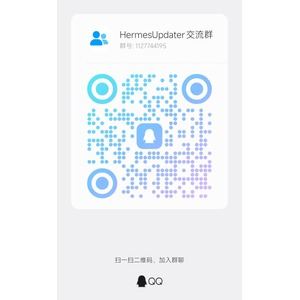

# HermesUpdater（赫尔墨斯更新器）

> 简体中文 | [English](README_EN.md)

一款为 **Hermes Agent** 打造的 Windows 桌面更新工具（Electron），针对中国大陆网络做了镜像加速、自动换源、一键网络自愈等深度优化。内置完整仪表盘、安装/卸载套件、更新钩子与 Webhook 推送，让 Hermes Agent 的安装、更新、维护全部在一个界面内完成。

> **最新版本：v2.24.0** — 便携版与安装版见 [Releases](https://github.com/LzxkJ04/hermes-updater/releases)。

---

## 📖 目录

- [功能一览](#-功能一览)
- [操作指南（详细）](#-操作指南详细)
- [下载](#-下载)
- [本地构建](#-本地构建)
- [常见问题](#-常见问题)
- [交流群](#-交流群)
- [许可证](#-许可证)

## ✨ 功能一览

### 更新
- **一键更新**：自动探测网络模式（直连 / 系统代理 / 手动代理 / 镜像），自动重试，自动镜像回退
- **更新预览（What's New）**：更新前查看待应用的提交（含哈希 / 日期 / 作者），心中有数再升级
- **🎯 更新目标选择器**：锁定远端分支或标签；可选锁定项，让每次更新前先检出该目标，离线环境也安全
- **📜 更新日志中心**：基于本地仓库生成按标签分组的更新日志，支持搜索与 Markdown 导出
- **🪝 更新钩子**：更新前 / 后 / 失败时执行自定义命令，支持单钩子超时与失败中止策略
- **🌐 Webhook 推送**：更新 / 安装 / 卸载时 POST JSON 通知（兼容企业微信 / 钉钉 / Slack）
- 自动倒计时确认、稍后提醒、定时更新计划、免打扰时段
- 更新后冒烟验证（`hermes --version`）、回滚至任意历史提交、更新备份与一键恢复
- 网络探测与**一键网络自愈**，逐次尝试的网络统计与失败分类

### 安装与卸载
- **安装页**：环境预检（Node / npm / Git / 磁盘空间）、一键安装、修复重装、安装历史
- **镜像测速**：git 智能协议 > HTTP 两级探测，一键应用，自动故障转移候选镜像
- **多模式卸载**：回收站 / 仅删除依赖 / 彻底删除 / 仅解除关联——含预检、配置备份、停止进程、输目录名二次确认防误删

### 仪表盘与诊断
- 重构后的仪表盘：状态胶囊、健康评分卡、快捷操作中心（更新 / Gateway / 安装·卸载·维护）
- Gateway 看门狗（掉线自动重启）、进程管理器、健康评分 + HTML 健康报告
- 更新统计（成功率 / 月度趋势 / 高频失败原因）、更新热力图、磁盘清理向导
- 应用内通知中心 + Windows 原生 Toast 通知

### 设置
- 70+ 项持久化设置，覆盖更新 / 网络 / 安装 / 卸载 / 外观 / 自动化
- 中英双语界面、深色模式 + 跟随系统、UI 缩放、单实例锁

## 📘 操作指南（详细）

### 一、更新 Hermes Agent

1. **一键更新**
   - 打开左侧「更新」页，点击 **检查更新**；程序自动探测当前网络可用方式（直连 / 系统代理 / 手动代理 / 镜像）。
   - 探测到新提交后，点击 **立即更新**；更新过程会自动重试并在多种网络方式间回退，无需手动干预。
   - 更新完成后执行冒烟验证（`hermes --version`），确认新版本可正常运行。

2. **更新预览（What's New）**
   - 在更新页可展开「待更新内容」，查看即将应用的提交列表，每条含 **提交哈希、日期、作者**，确认无误再升级。

3. **更新目标选择器（分支 / 标签锁定）**
   - 进入更新页「更新目标」面板，选择要追踪的 **远端分支** 或 **标签**（如 `main`、`v2.24.0`）。
   - 勾选「锁定目标」后，每次更新会先 `git checkout` 到该目标再拉取，避免误更新到其它分支；在离线或弱网环境下也能安全停留在指定版本。

4. **更新日志中心**
   - 在更新页「更新日志中心」点 **生成**，程序基于本地仓库按 **标签（tag）分组** 列出变更。
   - 使用顶部搜索框按关键词过滤；点 **导出 Markdown** 可把当前日志保存为 `.md` 文件，方便分享或归档。

5. **更新钩子（前 / 后 / 失败）**
   - 在设置页「钩子」分区，分别为 **更新前、更新后、更新失败** 填写要执行的命令（如备份脚本、清理命令）。
   - 每个钩子可设置 **超时时间**；勾选「失败时中止」可在钩子异常时中断更新流程，防止半成品上线。

6. **Webhook 推送**
   - 在设置页「Webhook」分区填写接收地址（支持企业微信 / 钉钉 / Slack 的 incoming webhook）。
   - 勾选要在哪些事件触发推送（更新 / 安装 / 卸载），程序会在事件发生时 **POST JSON** 通知；可先点 **测试** 验证连通性。

7. **回滚与备份**
   - 更新前会自动创建 **更新备份**；若新版本异常，在更新页点 **回滚**，可回到任意历史提交并一键恢复备份。

### 二、安装 Hermes Agent

1. **环境预检**
   - 打开「安装 Hermes」页，点击 **环境预检**；程序检测 Node / npm / Git 是否就绪以及磁盘剩余空间，并给出红/绿状态。

2. **一键安装 / 修复重装**
   - 预检通过直接点 **安装**；若已安装但异常，点 **修复重装** 在保留配置的前提下重新部署。
   - 「安装历史」记录每次安装的版本与时间，便于追溯。

3. **镜像测速与换源**
   - 在「安装 Hermes」页点 **镜像测速**；程序对候选镜像做 **git 智能协议 > HTTP** 两级探测并打分。
   - 选最快的一项点 **应用**，后续安装/更新走该镜像；若当前镜像失效，程序会 **自动故障转移** 到下一个候选。

### 三、卸载 Hermes Agent

1. 打开「卸载」页，先执行 **预检**（检测是否已停止相关进程、配置是否可备份）。
2. 选择卸载模式：
   - **回收站**：删除内容进回收站，可随时还原（最安全，默认）。
   - **仅删除依赖**：只移除 Node/依赖，保留 Hermes 本体与配置。
   - **彻底删除**：永久删除，不可恢复。
   - **仅解除关联**：取消与系统的关联（如开机自启、右键菜单），保留文件。
3. 为防止误删，需 **输入 Hermes 目录名** 二次确认，确认后点 **卸载**；卸载前会自动 **备份配置**。

### 四、仪表盘与诊断

- **状态胶囊**：顶部状态条显示 Hermes / Gateway / 网络 的实时状态（正常 / 警告 / 异常）。
- **健康评分卡**：综合进程、网络、更新成功率给出 0–100 健康分；点 **健康报告** 可生成 HTML 报告。
- **快捷操作中心**：一键直达 更新 / 重启 Gateway / 安装·卸载·维护 等高频操作。
- **Gateway 看门狗**：开启后 Gateway 掉线会自动重启，无需人工介入。
- **更新统计**：查看成功率、月度趋势、高频失败原因；**更新热力图** 直观展示活跃度。
- **磁盘清理向导**：扫描并清理缓存/日志等可释放空间，释放前可逐项确认。

### 五、设置

- 设置页按 **更新 / 网络 / 安装 / 卸载 / 外观 / 自动化** 分区，共 **70+ 项**持久化选项。
- **外观**：切换中文 / 英文，深色模式或跟随系统，调整 UI 缩放。
- **自动化**：配置定时更新计划、免打扰时段、单实例锁等行为。

## 📦 下载

从 [Releases](https://github.com/LzxkJ04/hermes-updater/releases) 获取最新安装包：

| 文件 | 说明 |
|---|---|
| `HermesUpdater-Portable.exe` | 单文件便携版，免安装，双击即用 |
| `HermesUpdater-Setup-x.y.z.exe` | NSIS 安装版（可选开机自启、开始菜单、桌面快捷方式） |

- 便携版适合绿色使用、U 盘携带；安装版适合长期固定使用，支持自动更新自身
- 每个版本的完整更新说明见对应 Release 页面与 [CHANGELOG](CHANGELOG.md)

## 🛠️ 本地构建

```bash
npm install
npm start            # 开发运行
npm run dist         # 打包 portable + NSIS（electron-builder）
node check.js        # 静态一致性校验（i18n / IPC / DOM id）
```

要求 Node 18+ 与 Windows 10 及以上系统（进程与磁盘功能依赖 PowerShell / CIM 集成）。

## ❓ 常见问题

**Q：便携版和安装版有什么区别？**
便携版是单文件免安装，双击即用，适合 U 盘携带或临时使用；安装版走 NSIS 安装向导，可选开机自启、开始菜单与桌面快捷方式，适合长期固定使用。

**Q：更新或下载很慢 / 连不上 GitHub 怎么办？**
进入「安装 Hermes」页使用**镜像测速**，一键切换到最快的镜像源；更新过程会自动在直连 / 代理 / 镜像之间探测与回退，也可以在设置中手动指定代理。网络异常时可用仪表盘的**一键网络自愈**。

**Q：更新后想回滚到旧版本？**
支持回滚至任意历史提交，且每次更新前会自动创建备份，可在界面内一键恢复。

**Q：卸载会误删我的配置吗？**
卸载前会执行预检、自动备份配置并可停止相关进程；默认「回收站」模式删除的内容可随时还原，还需要输入目录名二次确认，防止误删。

**Q：微信群二维码过期了怎么办？**
微信群二维码 7 天有效，过期后请改用下方的 QQ 群加入。

## 💬 交流群

欢迎加入交流群反馈问题、提出功能建议：

<div align="center">

<table>
  <tr>
    <th>QQ 群</th>
    <th>微信群</th>
  </tr>
  <tr>
    <td align="center"><b>群号：1127744195</b></td>
    <td align="center">扫码加入</td>
  </tr>
  <tr>
    <td align="center"></td>
    <td align="center"></td>
  </tr>
</table>

</div>

> 微信群二维码 **7 天内（2026-10-07 前）有效**，过期请加入上方 QQ 群。

## 📄 许可证

本项目采用 [MIT 许可证](LICENSE) —— 可自由使用、修改、分发，包括商业用途，但需保留版权声明。

Copyright (c) 2026 LzxkJ04
